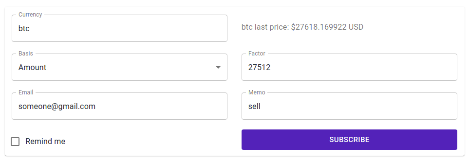

# Currency Reports

A web application to subscribe to alerts when a currency reaches
the price changes you set. (and more)

### Pre-requisites

 - Since the API is based in [gRPC](https://github.com/grpc/grpc)
   which uses HTTP2,  
   which at the same time requires a secure connection,  
   we're gonna need a server with its own (sub)domain and its SSL cert.  
   (You could use [certbot](https://certbot.eff.org/))
 - Clone and run
   [Currency Reports (daemons)](https://github.com/emmveqz/currency-reports)
 - Have `docker` and `docker-compose` installed.  
   (preferably docker-compose >= 2 otherwise you might get errors
   with the .yaml)
 - Create an access token from your github account
   with `read:packages` permissions.  
   (You can do that [here](https://github.com/settings/tokens))

### Instructions

 - Set your environment variables in [.env](./.env)  
   Must set your github access token in:  
   `GITHUB_AUTH_TOKEN`  
   in order to be able to install npm packages from the `@emmveqz` scope.
 - If you use [certbot](https://certbot.eff.org/) for your SSL cert.
   you can just try using:  
   `sh ./scripts/gen_ssl_cert`  
   `sh ./scripts/copy_ssl_cert`
 - If you create your SSL cert. in a custom way, you must copy its PEMs.  
   (read the bottom part of
   [./scripts/copy_ssl_cert](./scripts/copy_ssl_cert) to find out
   where to copy them)
 - Build and run the app with:  
   `docker-compose up -d`  
   (or without the `-d` option to keep watching the logs)

### Clean/reset containers
 - Stop (and optionally remove) the containers:  
   `docker-compose rm -s`
 - Remove the app images:  
   `docker image rm currency-reports_node_web_app:latest`

### App Preview
If we are lucky, and everything ran well,
we should see something like this  
when we access it through our browser:

